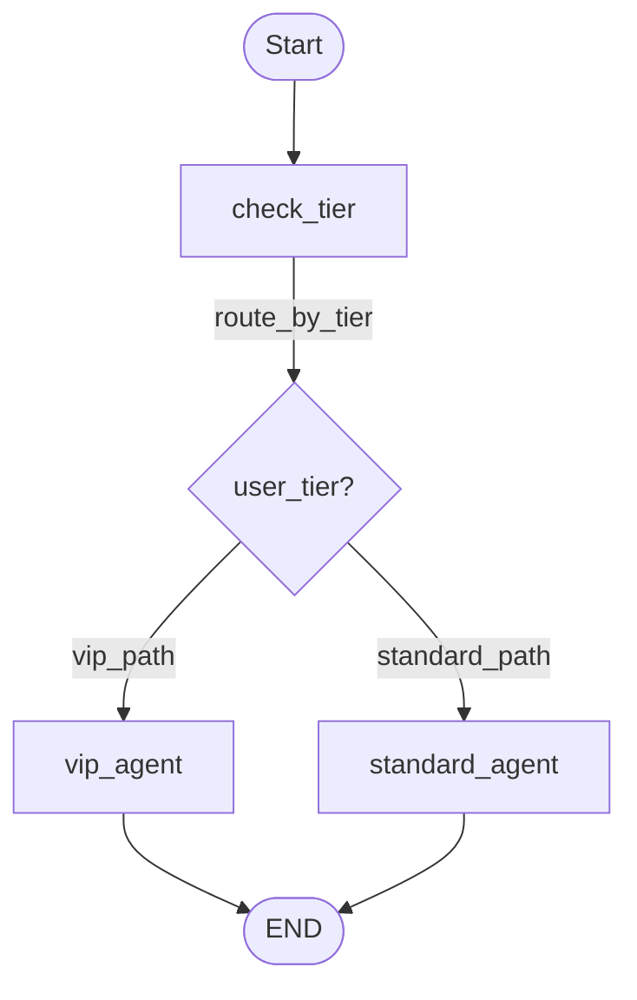
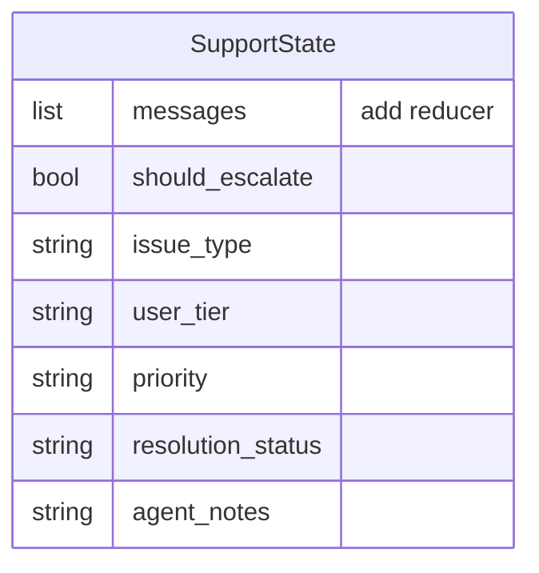
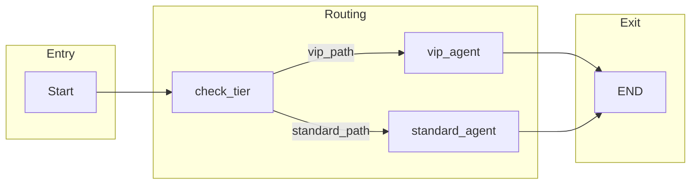

# Agentic Day2 Routing — Documentation

This document describes the TypedDicts, graph nodes, and edges used in the support routing workflow.

---

## Diagram view

### Graph flow



### State schema (SupportState)



### Node → Edge overview



---

## TypedDicts

### `SupportState`

The main state schema for the LangGraph workflow. All nodes read from and write to this state.

| Field | Type | Reducer | Description |
|-------|------|---------|-------------|
| `messages` | `list[BaseMessage]` | `add` | Conversation history. New messages are appended via the `add` reducer. |
| `should_escalate` | `bool` | — | Whether the request should be escalated to a specialist. |
| `issue_type` | `str` | — | Category of the issue: `shipping`, `billing`, `technical`, `general`, or `other`. |
| `user_tier` | `str` | — | Customer tier: `"vip"` or `"standard"`. |
| `priority` | `str` | — | Priority level: `"high"`, `"medium"`, or `"low"`. |
| `resolution_status` | `str` | — | Status: `"pending"`, `"resolved"`, or `"escalated"`. |
| `agent_notes` | `str` | — | Internal notes from the agent. |

**Initial state shape** (for `graph.invoke`):

```python
{
    "messages": [HumanMessage(content="...")],
    "should_escalate": False,
    "issue_type": "",
    "user_tier": "",
    "priority": "",
    "resolution_status": "",
    "agent_notes": "",
}
```

---

## Nodes

| Node ID | Function | Description |
|---------|----------|-------------|
| `check_tier` | `check_user_tier_node` | Entry node. Classifies user tier (VIP vs standard), issue type, and priority from the first message. Uses LLM when tier is not obvious from keywords. |
| `vip_agent` | `vip_agent_node` | Handles VIP customers. Produces a personalized response without escalation. |
| `standard_agent` | `standard_agent_node` | Handles standard customers. Uses LLM to decide escalation and generates a response. |

### Node details

#### `check_tier` → `check_user_tier_node`

- **Input**: `SupportState` (reads `messages[0]`)
- **Output**: Updates `user_tier`, `issue_type`, `priority`, `resolution_status`
- **Logic**:
  - Tier: keyword check for "vip"/"premium", else LLM classification
  - Issue type & priority: single LLM call returning two words (e.g. `"shipping medium"`)

#### `vip_agent` → `vip_agent_node`

- **Input**: `SupportState` (reads `messages[-1]`, `issue_type`, `priority`)
- **Output**: Updates `should_escalate`, `messages`, `resolution_status`, `agent_notes`
- **Logic**: Senior VIP agent prompt; always sets `should_escalate=True` and `resolution_status="escalated"` (implementation detail)

#### `standard_agent` → `standard_agent_node`

- **Input**: `SupportState` (reads `messages[-1]`, `issue_type`)
- **Output**: Updates `should_escalate`, `messages`, `resolution_status`, `agent_notes`
- **Logic**: LLM decides escalation; generates response; may mention specialist follow-up

---

## Edges

### Entry point

| From | To |
|------|-----|
| *(start)* | `check_tier` |

### Conditional edges

| From | Condition | To |
|------|-----------|-----|
| `check_tier` | `route_by_tier` returns `"vip_path"` | `vip_agent` |
| `check_tier` | `route_by_tier` returns `"standard_path"` | `standard_agent` |

**Routing logic** (`route_by_tier`):

- `user_tier == "vip"` → `"vip_path"`
- Otherwise → `"standard_path"`

### Unconditional edges

| From | To |
|------|-----|
| `vip_agent` | `END` |
| `standard_agent` | `END` |

---

## Summary

| Category | Items |
|----------|-------|
| **TypedDicts** | `SupportState` |
| **Nodes** | `check_tier`, `vip_agent`, `standard_agent` |
| **Edges** | Entry → `check_tier`; conditional `check_tier` → `vip_agent` / `standard_agent`; `vip_agent` → END; `standard_agent` → END |
